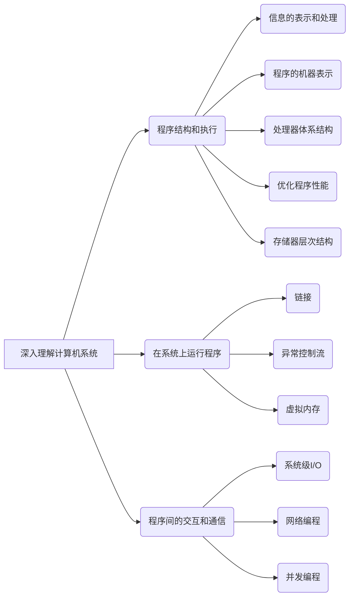
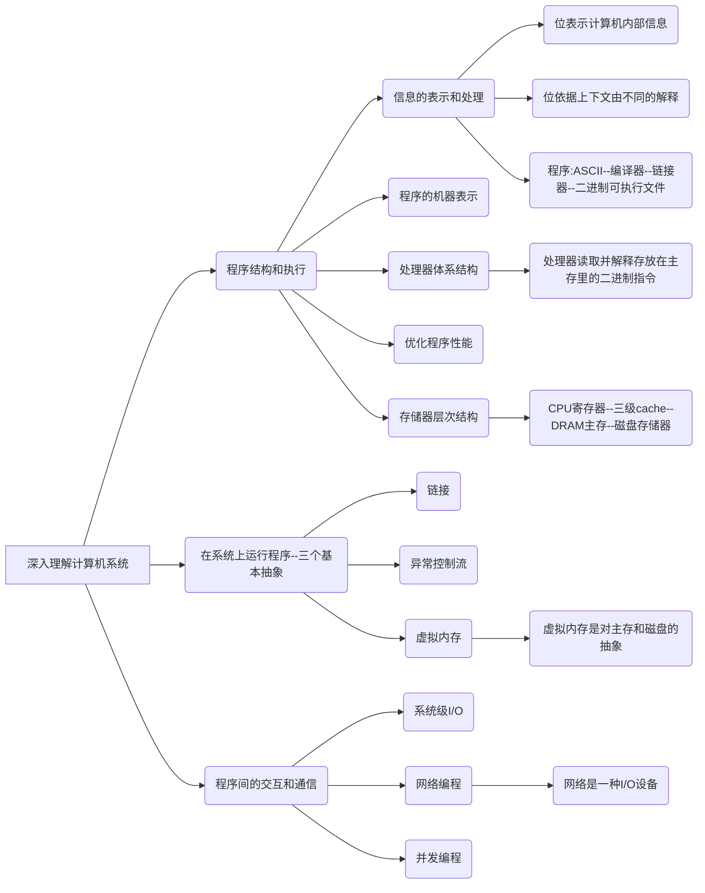
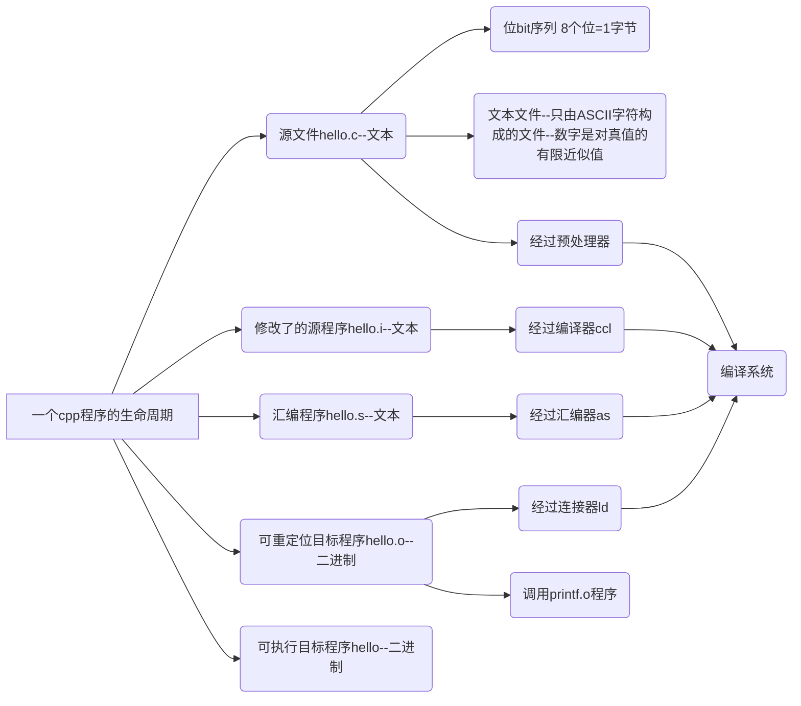
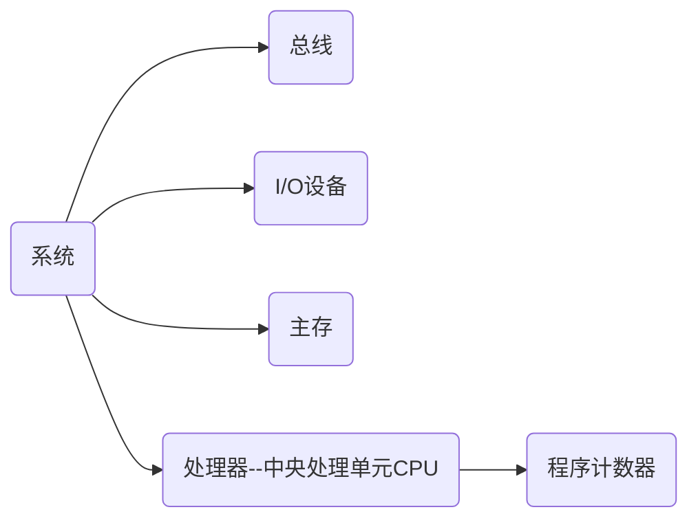

# 计算机系统漫游
## 目录

```mermaid
graph LR  
深入理解计算机系统--> A(程序结构和执行)
A--> A1(信息的表示和处理)
A--> A2(程序的机器表示)
A--> A3(处理器体系结构)
A--> A4(优化程序性能)
A--> A5(存储器层次结构)
深入理解计算机系统--> B(在系统上运行程序)
B--> B1(链接)
B--> B2(异常控制流)
B--> B3(虚拟内存)
深入理解计算机系统--> C(程序间的交互和通信)
C--> C1(系统级I/O)
C--> C2(网络编程)
C--> C3(并发编程)
```
<!-- more -->

## 序言
- 计算机系统 = 硬件 + 系统软件
- 

```mermaid
graph LR  
深入理解计算机系统--> A(程序结构和执行)
A--> A1(信息的表示和处理)
A1--> A11(位表示计算机内部信息)
A1--> A12(位依据上下文由不同的解释)
A1--> A13(程序:ASCII--编译器--链接器--二进制可执行文件)
A--> A2(程序的机器表示)
A--> A3(处理器体系结构)
A3-->A31(处理器读取并解释存放在主存里的二进制指令)
A--> A4(优化程序性能)
A--> A5(存储器层次结构)
A5-->A51(CPU寄存器--三级cache--DRAM主存--磁盘存储器)
深入理解计算机系统--> B(在系统上运行程序--三个基本抽象)
B--> B1(链接)
B--> B2(异常控制流)
B--> B3(虚拟内存)
B3-->B31(虚拟内存是对主存和磁盘的抽象)
深入理解计算机系统--> C(程序间的交互和通信)
C--> C1(系统级I/O)
C--> C2(网络编程)
C2-->C21(网络是一种I/O设备)
C--> C3(并发编程)
```
## 1. 信息=位+上下文

```mermaid
graph LR  
一个cpp程序的生命周期--> A(源文件hello.c--文本)
A-->A1(位bit序列 8个位=1字节)
A-->A2(文本文件--只由ASCII字符构成的文件--数字是对真值的有限近似值)
A-->A4(经过预处理器)
一个cpp程序的生命周期--> B(修改了的源程序hello.i--文本)
B--> B1(经过编译器ccl)
一个cpp程序的生命周期--> C(汇编程序hello.s--文本)
C--> C1(经过汇编器as)
一个cpp程序的生命周期--> D(可重定位目标程序hello.o--二进制)
D--> D1(经过连接器ld)
D--> D2(调用printf.o程序)
一个cpp程序的生命周期--> E(可执行目标程序hello--二进制)
A4-->X(编译系统)
B1-->X
C1-->X
D1-->X
```
## 2.系统的硬件组成

```mermaid
graph LR
A(系统)-->A1(总线)
A-->A2(I/O设备)
A-->A3(主存)
A-->A4(处理器--中央处理单元CPU)
A4-->A5(程序计数器)
```

## Amdahl定律
 